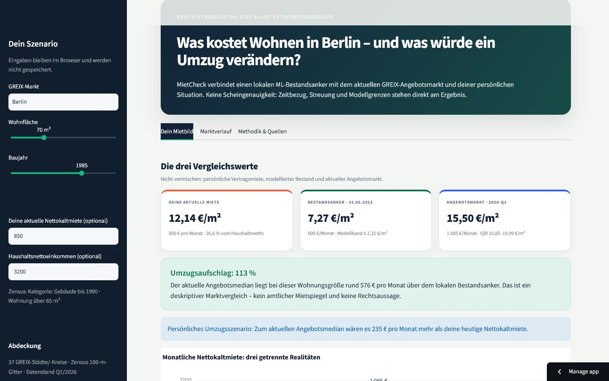

# MietCheck – drei Mietrealitäten statt einer Scheingenauigkeit

MietCheck ist eine Machine-Learning-App für das Modul **Data Analytics & Big Data**.
Sie stellt drei Werte bewusst getrennt nebeneinander:

1. den kleinräumig modellierten **Bestandsanker aus dem Zensus 2022**,
2. den **aktuellen Angebotsmarkt aus GREIX** (derzeit Q1/2026),
3. die **persönliche Vertragsmiete und Mietbelastung**.

Der zentrale Produktnutzen ist der **Umzugsaufschlag**: Wie groß ist die Lücke zwischen
dem lokalen Wohnungsbestand und dem Preis, der bei einer heutigen Wohnungssuche
tatsächlich aufgerufen wird? Zeitbezug, Marktstreuung und Modellunsicherheit werden
direkt am Ergebnis gezeigt.



> MietCheck ist ein wissenschaftlicher Prototyp, kein amtlicher Mietspiegel, keine
> Einzelwohnungsbewertung und keine Rechts- oder Finanzberatung.

## Online und Abgabeunterlagen

- **Repository:** [github.com/neleknaak-31/MietCheck](https://github.com/neleknaak-31/MietCheck)
- **Präsentation:** [PPTX](deliverables/MietCheck_Praesentation.pptx) · [PDF](deliverables/MietCheck_Praesentation.pdf)
- **Handout:** [DOCX](deliverables/MietCheck_Handout.docx) · [PDF](deliverables/MietCheck_Handout.pdf)
- **Vorbereitung:** [12-Minuten-Sprechskript](docs/PRESENTATION_SCRIPT.md) · [Demo-Runbook](docs/DEMO_RUNBOOK.md)

Die Präsentation umfasst zwölf Hauptfolien plus zwei Backup-Folien und enthält
Sprechernotizen. Das Handout ist auf fünf DIN-A4-Seiten begrenzt.

## Warum das Projekt eigenständig ist

Viele Mietrechner geben eine einzelne vermeintlich „faire“ Miete aus. MietCheck
vermischt dagegen nicht:

- **Bestand:** amtliche, kleinräumige Zensus-Mieten zum Stichtag 15.05.2022,
- **Angebot:** aktuelle GREIX-Angebotsmieten mit 25.–75. Perzentil,
- **Person:** tatsächliche Miete, Wohnfläche und Haushaltsnettoeinkommen.

Damit beantwortet die App nicht nur „Was kostet Wohnen?“, sondern die praktischere
Frage: **„Was würde ein Umzug für mich verändern – und wie belastbar ist der
Vergleich?“**

## Datenbasis

| Quelle | Verwendung | Umfang in MietCheck | Stand |
|---|---|---:|---|
| [Zensus 2022 – Gitterdaten](https://www.destatis.de/DE/Themen/Gesellschaft-Umwelt/Bevoelkerung/Zensus2022/_publikationen.html) | Zielvariable Nettokaltmiete sowie Bevölkerung, Haushaltsgröße, Eigentum, Leerstand, Wohnfläche und Wohnungszahl | 2.058.569 Modellzeilen, 1.184.386 eindeutige 100-m-Gitterzellen | 15.05.2022 |
| [GREIX Mietpreisindex](https://www.kielinstitut.de/de/institut/forschungszentren/makrooekonomie/makrofinanzen/mietpreisindex/) | nominale Angebotsmieten, Marktquartile und Zeitreihe | 2.166 Quartalswerte, 37 lokale Märkte plus Deutschlandreferenz | 2012-Q1 bis 2026-Q1 |

Die Zensusdaten stehen unter der **Datenlizenz Deutschland –
Namensnennung – Version 2.0**. GREIX wird unter Angabe des Kiel Instituts für
Weltwirtschaft und der VALUE Marktdatenbank verwendet. Rohdaten werden nicht in Git
versioniert; der Download erzeugt ein Manifest mit URL, Abrufzeitpunkt, Dateigröße und
SHA-256-Prüfsumme.

Details stehen in [DATA_CARD.md](docs/DATA_CARD.md) und
[MODEL_CARD.md](docs/MODEL_CARD.md).

## Methodik und belastbare Ergebnisse

Die Analyse folgt QUA³CK. Räumliche 25-km-Gruppen verhindern, dass benachbarte
Gitterzellen gleichzeitig in Training und Validierung landen.

| Prüfung | Ergebnis |
|---|---:|
| verglichene Modellfamilien | Kategorie-Baseline, Ridge, MLP, Random Forest, HistGradientBoosting |
| finales Modell | HistGradientBoostingRegressor |
| räumlich getrenntes Testset | 276.458 Zeilen in 99 bislang ungesehenen Raumgruppen |
| Test-MAE | **1,413 €/m²** |
| Test-Median-AE | **0,956 €/m²** |
| Test-RMSE | **2,130 €/m²** |
| Test-R² | **0,584** |
| Verbesserung gegenüber Kategorie-Baseline | **38,3 % MAE** |
| empirische Coverage des nominalen 90-%-Intervalls | **86,8 %** |

Die Coverage wird absichtlich als gemessene **86,8 %** und nicht als garantierte
90 % kommuniziert. Besonders für Neubauten ist die Schätzung schwächer. Diese
Abweichung ist Teil der fachlichen Aussage und keine versteckte Einschränkung.

## App lokal starten

Voraussetzung ist Python 3.11 bis 3.13.

```powershell
python -m venv .venv
.\.venv\Scripts\Activate.ps1
python -m pip install --upgrade pip
python -m pip install -r requirements.txt
python -m streamlit run app.py
```

Unter macOS/Linux wird die Umgebung mit `source .venv/bin/activate` aktiviert.
Die App benötigt zur Laufzeit keinen Download: kompakte Marktprofile, Zeitreihen
und das trainierte Modellartefakt liegen im Repository.

## Vollständig reproduzieren

Die folgenden Befehle laden die öffentlichen Quellen neu und bauen Daten,
Experimente, Modell, App-Profile und Notebooks nach:

```bash
python scripts/download_data.py
python scripts/build_dataset.py
python scripts/algorithm_benchmark.py
python scripts/feature_ablation.py
python scripts/tune_hgb.py
python scripts/train_final_model.py
python scripts/build_greix.py
python scripts/build_region_profiles.py
python scripts/generate_notebooks.py
python scripts/execute_notebooks.py
```

Der vollständige Lauf verarbeitet mehrere Millionen Zeilen und benötigt je nach
Rechner deutlich Zeit und Arbeitsspeicher. Experimentberichte werden als JSON unter
`reports/` geschrieben; die ausgeführten Notebooks enthalten die zugehörigen
Ergebnisse und Visualisierungen.

## Qualität prüfen

```bash
python -m pip install -r requirements-dev.txt
python -m ruff check .
python -m ruff format --check .
python -m pytest
```

Die Tests prüfen unter anderem Datenverträge, Download-Metadaten, räumliche Splits,
Modell- und GREIX-Pipelines, Notebook-Ausführung, App-Logik und einen
Streamlit-Render-Smoke-Test. GitHub Actions führt dieselben Qualitätsgates aus.

## QUA³CK-Notebooks

| Phase | Notebook |
|---|---|
| Gesamtüberblick | `00_gesamtueberblick_qua3ck.ipynb` |
| Q – Qualitätsprüfung | `01_qualitaetspruefung.ipynb` |
| U – Understanding the Data | `02_understanding_the_data.ipynb` |
| A – Algorithmenauswahl | `03_algorithmenauswahl.ipynb` |
| A³ – Anwendung, Anpassung, Auswertung | `04_modellentwicklung.ipynb` |
| C – Kreuzvalidierung und finaler Test | `05_kreuzvalidierung.ipynb` |
| K – Wissensextraktion | `06_wissensextraktion.ipynb` |

Alle sieben Notebooks wurden automatisiert ausgeführt; der Prüfbericht liegt in
`reports/notebook_execution.json`.

## Projektstruktur

```text
MietCheck/
├── app.py                      # Streamlit-Produkt
├── data/app/                   # kleine, deploybare Datenprodukte
├── models/                     # finales ML-Modell + Metadaten
├── notebooks/                  # ausgeführte QUA³CK-Analyse
├── scripts/                    # Download, Build, Experimente, Training
├── src/app_logic.py            # getestete App-Berechnungen
├── tests/                      # automatisierte Qualitätsprüfungen
├── docs/                       # Datenblatt, Modellkarte, Methodik
├── deliverables/               # Präsentation und 5-seitiges Handout
├── reports/                    # maschinenlesbare Experimentergebnisse
└── .github/workflows/ci.yml    # reproduzierbare CI
```

## Grenzen und verantwortungsvolle Nutzung

- Zensus 2022 beschreibt Bestandsmieten am Stichtag, GREIX aktuelle
  Angebotsmieten; die Differenz ist ein **deskriptiver Marktvergleich**.
- Die App arbeitet mit regionalen Profilen rund um 37 GREIX-Märkte, nicht mit einer
  adressgenauen Schätzung für jede Wohnung Deutschlands.
- Ausstattung, Mikrolage, Vertragsbeginn und rechtliche Besonderheiten sind nicht
  vollständig beobachtet.
- Das Unsicherheitsband beschreibt empirische Modellfehler, nicht die rechtlich
  zulässige Miete.
- Persönliche Eingaben werden nur in der laufenden Streamlit-Sitzung verarbeitet
  und nicht gespeichert.

## Quellenangabe

Zensus: *Statistische Ämter des Bundes und der Länder, Zensus 2022; eigene
Verarbeitung.*

GREIX: *Kiel Institut für Weltwirtschaft auf Basis der VALUE Marktdatenbank; eigene
Verarbeitung.*

Der Quellcode steht unter der [MIT-Lizenz](LICENSE). Drittanbieterdaten behalten
ihre jeweiligen Nutzungsbedingungen.
